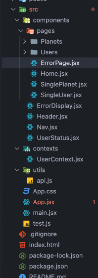

# NC News App

Welcome to the NC News app, here you can view and interact with a variety of articles, topics and comments.

## About the Project
App available at -  [nc-news-ah123.netlify.app](https://nc-news-ah123.netlify.app)

## Functionality

Utilized CRUD operations to the REST API.

- READ:-All articles can be sorted by newest-oldest, popularity of votes and comments.
- READ:- Articles can be filtered by topic.
- READ:- You can view comments on an article 
- UPDATE:- When on an article page you can up and down vote an article
- CREATE:- You can post a comment on the article
- CREATE:- You can post your own article
- DELETE:- You can delete your own comments if you change your mind

## Built With

- [![React][React.js]][React-url]
- Vite 
- React Router
- Netlify
- Axios
- JavaScript
- JSX


API Repo - 
https://github.com/AvrilHunter/NC-News   
 
Hosted API - https://nc-news-z2fk.onrender.com/api/

## Accessibility 

Used a variety of tools to improve accessibility
- Semantic HTML
- Alt text on images
- Contrast checker
- Viewed with a screen reader
- Passed Wave, Lighthouse, axe DevTools audits and inspected with browser accessability tools.

## Skills Displayed

- Planning wireframes and component trees 
- Using React Context and State 
- Custom React Hooks created (error and loading hooks, data fetching hooks)
- Axios requests
- Error handling
- Loading screens and animations
- Optimistic rendering (example in the voting buttons for an article)
- UX and UI
- Data validation for forms, including feedback for the user


## Getting Started

Please follow these simple steps to run the project locally.  

### Repo

Repo can be found here:- https://github.com/AvrilHunter/nc-news-project

### Installation
1. Clone the repo
```sh
git clone https://github.com/AvrilHunter/nc-news-project
```
2. Install NPM packages
```sh
npm install
```
3. Run the app with Vite
```sh
npm run dev
```

## Minimum requirements

Node v21.7.1

## Contact

avrilhunter15@gmail.com


[React.js]: https://img.shields.io/badge/React-20232A?style=for-the-badge&logo=react&logoColor=61DAFB
[React-url]: https://reactjs.org/

